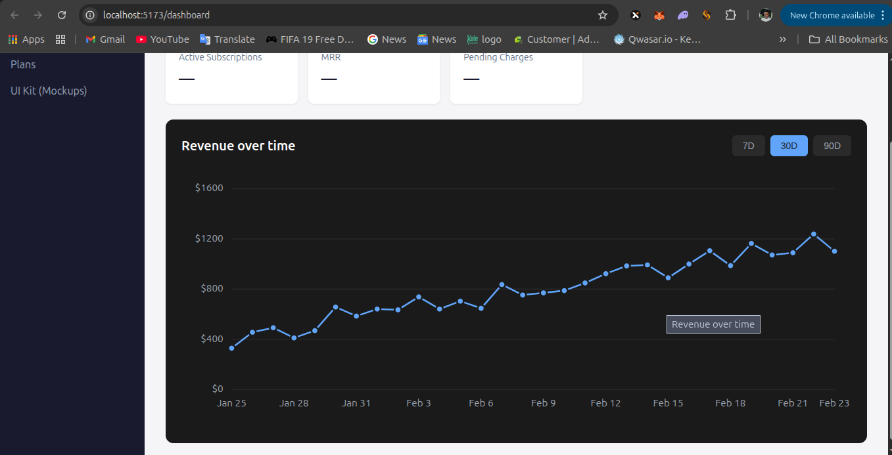

# Implementation: Dashboard Revenue Chart & Subscription Cards

This PR implements two key features for the Stellabill frontend:

## 🎯 Features Implemented

### 1. Revenue Over Time Chart (#49)
A merchant dashboard component displaying revenue trends with interactive time range selection.

### 2. Customer Subscription Cards (#58)
Reusable subscription card components for the "My Subscriptions" page with comprehensive subscription details.

---

## 📊 Feature 1: Revenue Over Time Chart

### Screenshot


### Implementation Details

**Components Created:**
- `src/components/RevenueChart.tsx` - Main chart component
- `src/components/RevenueChart.css` - Dark theme styling
- `src/components/RevenueChart.api.md` - API integration guide

**Features:**
- ✅ Dark theme background (#1a1a1a)
- ✅ "Revenue over time" title in bold white
- ✅ 7D/30D/90D time range selector with light blue active state (#60a5fa)
- ✅ SVG-based line chart with light blue line and circular markers
- ✅ Grid lines for better readability
- ✅ Y-axis with revenue values ($0 - $1600)
- ✅ X-axis with date labels
- ✅ Hover tooltips showing exact revenue values
- ✅ Responsive design with horizontal scroll on small screens
- ✅ Accessible with ARIA labels and semantic HTML
- ✅ Mock data generator with increasing trend

**Technical Stack:**
- Pure SVG implementation (no external chart libraries)
- React hooks (useState, useMemo)
- Responsive CSS with mobile-first approach

**Integration:**
- Added to Dashboard page (`src/pages/Dashboard.tsx`)
- Ready for API integration (see `RevenueChart.api.md`)

---

## 🎴 Feature 2: Customer Subscription Cards

### Screenshot


### Implementation Details

**Components Created:**
- `src/components/SubscriptionCard.tsx` - Reusable card component
- `src/components/SubscriptionCard.css` - Dark theme styling
- `src/components/SubscriptionCard.api.md` - API integration guide

**Features:**
- ✅ Dark theme card design (#1a1a1a background)
- ✅ Plan icon, name, and merchant display
- ✅ Status badges with color coding:
  - Green (#22c55e) for Active with up arrow icon
  - Yellow (#fbbf24) for Paused
  - Red (#ef4444) for Cancelled
- ✅ Price display with currency and interval
- ✅ Subscription ID display
- ✅ Prepaid balance in teal pill (#14b8a6)
- ✅ Coverage calculation (~X payments)
- ✅ Next charge date with calendar icon
- ✅ Manage button linking to detail page
- ✅ External link icon for opening in new tab
- ✅ Responsive 2-column grid (stacks to 1 column on mobile)
- ✅ Loading and empty states
- ✅ Hover effects and smooth transitions
- ✅ Accessible with ARIA labels

**Sample Data:**
Two subscription cards are displayed:
1. **Premium Access** (Stellar News) - 10 USDC/month, 30 USDC balance
2. **Pro Plan** (CloudFlow) - 25 USDC/month, 75 USDC balance

**Technical Stack:**
- TypeScript with proper type definitions
- React Router for navigation
- CSS Grid for responsive layout
- Semantic HTML for accessibility

**Integration:**
- Updated Subscriptions page (`src/pages/Subscriptions.tsx`)
- Ready for API integration (see `SubscriptionCard.api.md`)

---

## 🚀 Getting Started

### Installation
```bash
npm install
```

### Development Server
```bash
npm run dev
```

### View the Features
1. **Revenue Chart**: Navigate to Dashboard (`http://localhost:5173/`)
2. **Subscription Cards**: Navigate to Subscriptions (`http://localhost:5173/subscriptions`)

---

## 📝 API Integration

Both features are currently using mock data. To integrate with your backend:

### Revenue Chart API
```typescript
GET /api/revenue?days={7|30|90}

Response:
{
  "data": [
    { "date": "Jan 1", "revenue": 450 },
    { "date": "Jan 2", "revenue": 520 }
  ]
}
```

### Subscriptions API
```typescript
GET /api/customer/subscriptions

Response:
{
  "data": [
    {
      "id": "SUB-001",
      "planName": "Premium Access",
      "merchant": "Stellar News",
      "status": "active",
      "price": 10,
      "currency": "USDC",
      "interval": "month",
      "prepaidBalance": 30,
      "coverage": 3,
      "nextChargeDate": "Mar 15, 2026",
      "icon": "📰"
    }
  ]
}
```

See the respective `.api.md` files for detailed integration instructions.

---

## ✅ Testing Checklist

### Revenue Chart
- [x] Chart renders with correct axes and labels
- [x] Time range selector updates data (7D/30D/90D)
- [x] Active button shows light blue background
- [x] Hover tooltips display correct values
- [x] Responsive design works on mobile
- [x] Accessible with screen readers

### Subscription Cards
- [x] Cards render with all required fields
- [x] Status badges display correct colors
- [x] Prepaid balance shows in teal pill
- [x] Manage button navigation works
- [x] External link icon functions correctly
- [x] Responsive grid adapts to screen size
- [x] Loading and empty states display
- [x] Hover effects work smoothly

---

## 🎨 Design Compliance

Both features follow the Figma design specifications:
- Dark theme throughout (#1a1a1a backgrounds)
- Light blue accent color (#60a5fa) for active states
- Teal color (#14b8a6) for balance displays
- Proper spacing, typography, and visual hierarchy
- Responsive layouts for all screen sizes
- Accessibility best practices

---

## 📦 Files Changed

### New Files
- `src/components/RevenueChart.tsx`
- `src/components/RevenueChart.css`
- `src/components/RevenueChart.api.md`
- `src/components/SubscriptionCard.tsx`
- `src/components/SubscriptionCard.css`
- `src/components/SubscriptionCard.api.md`
- `docs/designs/revenue-chart-implementation.png`
- `docs/designs/subscription-cards-implementation.png`

### Modified Files
- `src/pages/Dashboard.tsx` - Added RevenueChart component
- `src/pages/Subscriptions.tsx` - Added SubscriptionCard grid

---

## 🔗 Closes Issues

- Closes #49 - Implement merchant dashboard Revenue over time chart
- Closes #58 - Implement customer subscription cards

---

## 👥 Contributors

- [@Christopherdominic](https://github.com/Christopherdominic)

---

## 📸 Screenshots Summary

### Revenue Chart
The chart displays revenue trends over selectable time periods (7D/30D/90D) with:
- Dark theme background
- Light blue line with markers
- Interactive tooltips
- Responsive grid layout

### Subscription Cards
The cards show subscription details in a clean, organized layout with:
- Plan information and status
- Prepaid balance and coverage
- Next charge date
- Action buttons for management

Both features are production-ready and awaiting backend API integration.
